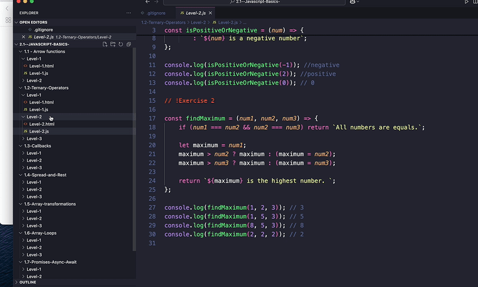

# 📘 JavaScript Basics – Exercises

This repository contains the JavaScript exercises required for Sprint #2 of ITACADEMY.

### ✅ Status: **Completed**

## 📁 Repository Structure

Each concept is broken down into **topics** and **levels of difficulty (Level-1, Level-2, Level-3)**. Exercises are implemented in separate folders, each with:

- ✅ An **HTML file** showing the output (answers appear in blue).
- ✅ A **JavaScript file** (main deliverable).
- 🛠 Some exercises include `console.log()` for testing and must be inspected using the browser console.

> 💡 Although each section was originally developed on separate branches, **all exercises are available in the `main` branch**.

### 📸  Preview

---

## 📚 Topics & Objectives

### **1.1 – Arrow Functions**

- Convert regular functions to arrow functions.
- Create arrow functions with and without parameters.
- Use `this` within arrow functions inside classes.
- Use arrow functions in loops and asynchronous contexts (e.g., `setTimeout`).

### **1.2 – Ternary Operators**

- Apply basic ternary syntax.
- Compare two values.
- Chain ternary expressions.
- Use ternary operators in loops and with functions.

### **1.3 – Callbacks**

- Create and invoke callback functions.
- Use callbacks with math operations.
- Apply callbacks in asynchronous logic (e.g., delays).
- Use callbacks with arrays and strings.

### **1.4 – Spread and Rest Operators**

- Merge arrays and copy objects using spread.
- Use rest parameters in function arguments.
- Combine destructuring with rest.
- Merge objects and pass array values as function arguments using spread.

### **1.5 – Array Transformations**

- Practice `map`, `filter`, `find`, `reduce`.
- Chain transformations to perform calculations in one line.
- Use `every` and `some` for condition checks.

### **1.6 – Array Loops**

- Use `forEach`, `for-of`, `for-in`, and conditional loops.
- Combine loops with conditions and break statements.
- Track element indexes manually in `for-of` loops.

### **1.7 – Promises & Async/Await**

- Create and handle Promises.
- Use `.then`, `.catch`, and `async/await`.
- Handle rejections and errors.
- Use `Promise.all` to manage multiple asynchronous operations.

---

## 🧠 Learning Goals

- Understand and practice **arrow functions**.
- Learn how to use the **ternary operator** in various contexts.
- Gain familiarity with **callback functions**.
- Use **rest** and **spread** operators in arrays and objects.
- Practice **looping** and **array transformations** (`map`, `filter`, etc.).
- Understand how to handle **asynchronous operations** using **Promises** and `async/await`.
